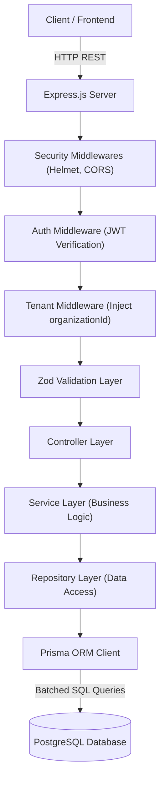
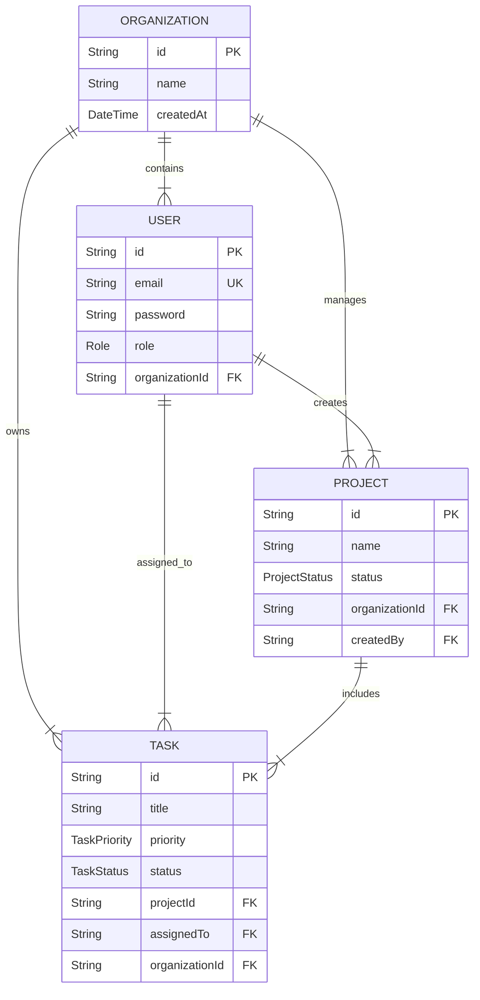

# WorkGrid — Multi-Tenant SaaS Backend


**WorkGrid** is a production-grade, highly scalable, multi-tenant project and task management SaaS backend. Built with **Node.js, Express, TypeScript, Prisma ORM, and PostgreSQL**, it is engineered from the ground up to guarantee strict tenant isolation, sub-millisecond query performance, and robust horizontal/vertical scalability capable of effortlessly handling thousands of projects and tasks per organization.

---

## 📑 Table of Contents
1. [Architecture Overview](#-architecture-overview)
2. [Multi-Tenant Isolation Strategy](#-multi-tenant-isolation-strategy)
3. [Scalability & Performance Optimizations](#-scalability--performance-optimizations)
4. [Database Schema & Entity Explanation](#-database-schema--entity-explanation)
5. [Tradeoff Decisions & Architectural Considerations](#-tradeoff-decisions--architectural-considerations)
6. [Folder Structure](#-folder-structure)
7. [Environment Variables](#-environment-variables)
8. [Setup & Local Development Instructions](#-setup--local-development-instructions)
9. [Comprehensive API Documentation & Sample Requests](#-comprehensive-api-documentation--sample-requests)

---

## 🏛 Architecture Overview

WorkGrid adheres to a strict **N-Tier Layered Architecture**, separating concerns across distinct operational planes. This decoupling ensures maximum testability, maintainability, and clean boundary enforcement.



### Layer Breakdown
- **Transport & Middleware Layer**: Handles incoming HTTP requests, standardizes security headers via `Helmet`, manages `CORS`, and logs requests via `Morgan`.
- **Security & Tenant Scoping Layer**: Authenticates JWT tokens (`auth.middleware.ts`), resolves the user's tenant context (`organizationId`), and attaches a strongly-typed `tenant` object to the Express request lifecycle (`tenant.middleware.ts`).
- **Validation Layer**: Employs `Zod` schemas (`*.validator.ts`) to strictly sanitize and validate incoming `body`, `query`, and `params` payloads before they reach business logic.
- **Controller Layer**: Orchestrates HTTP request/response handling, leverages `asyncHandler` for centralized error catching, and delegates execution to the service layer.
- **Service Layer**: Encapsulates core domain business logic, enforces permission checks, and coordinates multi-entity operations.
- **Repository Layer**: Acts as the exclusive data access abstraction (`*.repository.ts`), interacting directly with Prisma Client and guaranteeing explicit query optimization.

---

## 🔒 Multi-Tenant Isolation Strategy

WorkGrid employs a **Logical Isolation (Pool-Based Multi-Tenancy)** strategy within a single shared PostgreSQL instance. Every tenant (Organization) shares the same database infrastructure, but data is strictly isolated at the application and query level.

```mermaid
graph LR
    Subgraph Tenant Scoping Flow
    Req["Incoming Request"] --> JWT["Extract JWT Token"]
    JWT --> Middleware["Tenant Middleware"]
    Middleware --> Inject["Inject organizationId into Context"]
    Inject --> RepoQuery["Enforce where: { organizationId } in Repository"]
    end
```

### Core Tenets of the Isolation Model
1. **Mandatory Tenant Keys**: Every major domain entity (`User`, `Project`, `Task`) contains a non-nullable `organizationId` foreign key.
2. **Context Injection**: Upon successful JWT authentication, the `TenantMiddleware` extracts `organizationId`, `userId`, and `role`, binding them to `req.tenant`.
3. **Repository Enclosure**: Every repository method requires `organizationId` as a mandatory parameter, automatically appending `where: { organizationId }` to Prisma queries. This ensures that even if a malicious user passes a valid `projectId` belonging to another tenant, the query will return `null`.
4. **Tenant Helper Utility**: `TenantHelper.withTenantCreate` automatically binds the tenant ID to creation payloads, eliminating the possibility of developer oversight during entity creation.

---

## ⚡ Scalability & Performance Optimizations

To ensure APIs remain blazing fast with **1,000+ projects and 1,000+ tasks** per organization, WorkGrid incorporates advanced database and query-level optimizations.

### 1. High-Performance Database Indexing
Compound B-Tree indexes were strategically added to `prisma/schema.prisma` to align perfectly with the application's filtering, sorting, and foreign-key access patterns:
- **`Organization`**: `@@index([createdAt])`
- **`User`**: `@@index([organizationId, createdAt])`, `@@index([organizationId, email])`
- **`Project`**: `@@index([organizationId, status])`, `@@index([organizationId, createdAt])`, `@@index([organizationId, name])`
- **`Task`**: `@@index([organizationId, status])`, `@@index([organizationId, priority])`, `@@index([organizationId, projectId])`, `@@index([organizationId, assignedTo])`, `@@index([organizationId, dueDate])`, `@@index([organizationId, createdAt])`, `@@index([id])`

*Result*: Queries filtering by tenant and status/priority avoid full table scans, executing via highly efficient index-only scans.

### 2. Prisma Query Optimization & Explicit Selects
Naive ORM usage often leads to **over-fetching** (pulling entire rows including heavy text blocks or sensitive password hashes). WorkGrid entirely eliminates `include` statements in favor of **explicit `select` payloads**.
- **Security**: `UserRepository` uses a dedicated `userSelect` object that strips `password` hashes from all responses.
- **Payload Reduction**: `ProjectRepository` and `TaskRepository` fetch only necessary scalar fields, drastically reducing network serialization overhead.

### 3. N+1 Problem Mitigation
When fetching complex nested graphs (e.g., `GET /api/v1/projects/:id/full-data` which retrieves a Project, all its Tasks, and the assigned User for each Task), naive ORM implementations execute $1 + N$ queries. 
WorkGrid leverages Prisma's Rust-based Query Engine to perform **batched query optimization**. Instead of 1,000+ queries, Prisma executes exactly **3 batched SQL queries**:
```sql
-- Query 1: Fetch Project
SELECT id, name, description, status FROM projects WHERE id = $1 AND organizationId = $2;

-- Query 2: Fetch Tasks (Batched via WHERE IN)
SELECT id, title, priority, status, assignedTo FROM tasks WHERE projectId IN ($1);

-- Query 3: Fetch Assignees (Batched via WHERE IN)
SELECT id, name, email FROM users WHERE id IN ($1, $2, $3, ...);
```
Prisma stitches the in-memory graph together instantly, allowing the endpoint to scale effortlessly regardless of task volume.

### 4. Advanced Dual-Mode Pagination (`PaginationUtil`)
WorkGrid provides a sophisticated pagination utility (`src/utils/pagination.ts`) supporting both industry-standard pagination models:
- **Offset Pagination (`page`, `limit`)**: Best for administrative tables requiring direct page jumping. Uses `skip` and `take`.
- **Cursor Pagination (`cursor`, `limit`)**: Best for infinite scrolling and high-frequency real-time feeds. Eliminates `OFFSET` performance degradation on deep pages.
- **Deterministic Sorting**: To prevent pagination drift or duplicate records during cursor pagination, `PaginationUtil` automatically injects a secondary unique sort condition (`{ id: sortOrder }`) into every query.

---

## 🗄 Database Schema & Entity Explanation



### Entity Overview
- **`Organization`**: The root tenant container representing a company or workspace.
- **`User`**: Scoped entirely to an `Organization`. Contains RBAC roles (`OWNER`, `ADMIN`, `MEMBER`).
- **`Project`**: High-level organizational container for tasks. Belongs to an `Organization` and tracks creator metadata.
- **`Task`**: The atomic unit of work. Links directly to a `Project`, `Organization`, and an optional `assignee` (`User`).

---

## ⚖ Tradeoff Decisions & Architectural Considerations

### 1. Single Shared Database vs. Database-Per-Tenant
- **Decision**: Logical isolation within a single shared database.
- **Tradeoff**: While a database-per-tenant model offers ultimate physical isolation, it introduces immense operational complexity, migration overhead, and high infrastructure costs. A shared database with strict application-level scoping provides the perfect balance of cost efficiency, connection pool management, and developer velocity for a growing SaaS.

### 2. Prisma ORM vs. Raw SQL / Query Builders (e.g., Kysely, Knex)
- **Decision**: Prisma ORM.
- **Tradeoff**: Prisma introduces a slight memory overhead due to its Rust query engine. However, the benefits—unmatched TypeScript type safety, automated migration generation, and out-of-the-box batched relation loading (solving N+1 queries)—far outweigh the micro-benchmarking gains of raw SQL.

### 3. Offset vs. Cursor Pagination
- **Decision**: Supported both via `PaginationUtil`.
- **Tradeoff**: Offset pagination is intuitive but becomes expensive on deep queries (`OFFSET 50000` requires scanning and discarding 50,000 rows). Cursor pagination is $O(1)$ index-backed but does not support jumping directly to page 25. Providing both empowers frontend engineers to choose the optimal UX pattern per view.

---

## 📁 Folder Structure

```text
WorkGrid/
├── prisma/
│   ├── schema.prisma               # Prisma declarative data model & indexes
│   └── seed.ts                     # Database seeding script
├── src/
│   ├── config/
│   │   └── prisma.ts               # Prisma Client singleton initialization
│   ├── controllers/                # HTTP request handlers & orchestration
│   │   ├── auth.controller.ts
│   │   ├── project.controller.ts
│   │   ├── task.controller.ts
│   │   └── user.controller.ts
│   ├── middlewares/                # Express middleware pipeline
│   │   ├── auth.middleware.ts      # JWT verification
│   │   ├── errorHandler.ts         # Global centralized error handler
│   │   ├── performance.middleware.ts # API latency tracking
│   │   └── tenant.middleware.ts    # Tenant context resolution
│   ├── repositories/               # Direct data access & select optimization
│   │   ├── organization.repository.ts
│   │   ├── project.repository.ts
│   │   ├── task.repository.ts
│   │   └── user.repository.ts
│   ├── routes/                     # Express API route declarations
│   │   ├── auth.routes.ts
│   │   ├── index.ts                # Main v1 API router mounting
│   │   ├── project.routes.ts
│   │   ├── task.routes.ts
│   │   └── user.routes.ts
│   ├── services/                   # Core business logic & permission checks
│   │   ├── auth.service.ts
│   │   ├── project.service.ts
│   │   ├── task.service.ts
│   │   └── user.service.ts
│   ├── types/                      # TypeScript interface declarations
│   │   ├── auth.types.ts
│   │   └── index.ts                # Custom request & pagination types
│   ├── utils/                      # Helper utilities & cross-cutting concerns
│   │   ├── AppError.ts             # Custom operational error class
│   │   ├── asyncHandler.ts         # Promise wrapper for Express routes
│   │   ├── jwt.ts                  # JWT signing and verification wrapper
│   │   ├── pagination.ts           # Advanced dual-mode pagination engine
│   │   └── tenantHelper.ts         # Tenant payload injection helper
│   ├── app.ts                      # Express app setup & middleware wiring
│   └── server.ts                   # Entry point & HTTP server binding
├── .env.example                    # Sample environment variables
├── package.json                    # Dependencies & NPM scripts
├── tsconfig.json                   # TypeScript compiler configuration
└── README.md                       # Complete project documentation
```

---

## ⚙ Environment Variables

Create a `.env` file in the root directory with the following configuration:

| Variable | Type | Default | Description |
| :--- | :--- | :--- | :--- |
| `PORT` | Number | `5000` | The port on which the Express server listens. |
| `DATABASE_URL` | String | `postgresql://...` | Connection string for the PostgreSQL database. |
| `JWT_SECRET` | String | `supersecretjwtkey` | Cryptographic secret used to sign and verify JWTs. |
| `JWT_EXPIRES_IN` | String | `7d` | Token validity duration (e.g., `15m`, `7d`). |
| `NODE_ENV` | String | `development` | Operating environment (`development`, `production`). |

---

## 🚀 Setup & Local Development Instructions

### Prerequisites
- **Node.js**: v18.0.0 or higher
- **PostgreSQL**: v15.0 or higher
- **Git**

### Step-by-Step Installation

1. **Clone the repository**
   ```bash
   git clone https://github.com/Sharkyyyx28/WorkGrid.git
   cd WorkGrid
   ```

2. **Install dependencies**
   ```bash
   npm install
   ```

3. **Configure Environment Variables**
   Copy the example environment file and update the `DATABASE_URL` with your local PostgreSQL credentials:
   ```bash
   cp .env.example .env
   ```

4. **Run Database Migrations & Generate Prisma Client**
   ```bash
   npx prisma migrate dev --name init
   npx prisma generate
   ```

5. **Start the Development Server**
   ```bash
   npm run dev
   ```
   The server will start locally at `http://localhost:5000`.

6. **Build for Production**
   ```bash
   npm run build
   npm run start
   ```

---

## 📖 Comprehensive API Documentation & Sample Requests

### 1. Authentication APIs

#### Register Organization & Owner
```bash
curl -X POST http://localhost:5000/api/v1/auth/register \
  -H "Content-Type: application/json" \
  -d '{
    "organizationName": "Acme Corp",
    "name": "Jane Doe",
    "email": "jane@acme.com",
    "password": "SecurePassword123!"
  }'
```
**Response (201 Created)**:
```json
{
  "success": true,
  "token": "eyJhbGciOiJIUzI1NiIsInR5cCI6IkpXVCJ9...",
  "user": {
    "id": "usr_12345",
    "name": "Jane Doe",
    "email": "jane@acme.com",
    "role": "OWNER",
    "organizationId": "org_67890",
    "createdAt": "2026-05-19T02:00:00.000Z",
    "updatedAt": "2026-05-19T02:00:00.000Z"
  },
  "organization": {
    "id": "org_67890",
    "name": "Acme Corp"
  }
}
```

#### User Login
```bash
curl -X POST http://localhost:5000/api/v1/auth/login \
  -H "Content-Type: application/json" \
  -d '{
    "email": "jane@acme.com",
    "password": "SecurePassword123!"
  }'
```

---

### 2. Project APIs

#### Create Project
```bash
curl -X POST http://localhost:5000/api/v1/projects \
  -H "Authorization: Bearer <YOUR_JWT_TOKEN>" \
  -H "Content-Type: application/json" \
  -d '{
    "name": "Q3 Cloud Migration",
    "description": "Migrate legacy infrastructure to AWS",
    "status": "ACTIVE"
  }'
```
**Response (201 Created)**:
```json
{
  "success": true,
  "data": {
    "id": "prj_11111",
    "name": "Q3 Cloud Migration",
    "description": "Migrate legacy infrastructure to AWS",
    "status": "ACTIVE",
    "organizationId": "org_67890",
    "createdBy": "usr_12345",
    "createdAt": "2026-05-19T02:05:00.000Z",
    "updatedAt": "2026-05-19T02:05:00.000Z"
  }
}
```

#### Get Projects (Offset Pagination & Filtering)
```bash
curl -X GET "http://localhost:5000/api/v1/projects?page=1&limit=5&status=ACTIVE&sortBy=createdAt&sortOrder=desc" \
  -H "Authorization: Bearer <YOUR_JWT_TOKEN>"
```
**Response (200 OK)**:
```json
{
  "success": true,
  "data": [
    {
      "id": "prj_11111",
      "name": "Q3 Cloud Migration",
      "description": "Migrate legacy infrastructure to AWS",
      "status": "ACTIVE",
      "organizationId": "org_67890",
      "createdBy": "usr_12345",
      "createdAt": "2026-05-19T02:05:00.000Z",
      "updatedAt": "2026-05-19T02:05:00.000Z"
    }
  ],
  "meta": {
    "total": 1,
    "page": 1,
    "limit": 5,
    "totalPages": 1,
    "hasNextPage": false,
    "nextCursor": null
  }
}
```

#### Get Project Full Data (Batched N+1 Optimized Graph)
```bash
curl -X GET http://localhost:5000/api/v1/projects/prj_11111/full-data \
  -H "Authorization: Bearer <YOUR_JWT_TOKEN>"
```
**Response (200 OK)**:
```json
{
  "success": true,
  "data": {
    "id": "prj_11111",
    "name": "Q3 Cloud Migration",
    "description": "Migrate legacy infrastructure to AWS",
    "status": "ACTIVE",
    "createdAt": "2026-05-19T02:05:00.000Z",
    "updatedAt": "2026-05-19T02:05:00.000Z",
    "tasks": [
      {
        "id": "tsk_22222",
        "title": "Setup VPC Peering",
        "priority": "HIGH",
        "status": "IN_PROGRESS",
        "dueDate": "2026-06-01T00:00:00.000Z",
        "assignee": {
          "id": "usr_12345",
          "name": "Jane Doe",
          "email": "jane@acme.com"
        }
      }
    ]
  }
}
```

---

### 3. Task APIs

#### Create Task
```bash
curl -X POST http://localhost:5000/api/v1/tasks \
  -H "Authorization: Bearer <YOUR_JWT_TOKEN>" \
  -H "Content-Type: application/json" \
  -d '{
    "title": "Setup VPC Peering",
    "description": "Configure peering between us-east-1 and us-west-2",
    "priority": "HIGH",
    "status": "IN_PROGRESS",
    "dueDate": "2026-06-01T00:00:00.000Z",
    "projectId": "prj_11111",
    "assignedTo": "usr_12345"
  }'
```

#### Get Tasks (Cursor Pagination)
```bash
curl -X GET "http://localhost:5000/api/v1/tasks?limit=2&cursor=tsk_22222&sortBy=dueDate&sortOrder=asc" \
  -H "Authorization: Bearer <YOUR_JWT_TOKEN>"
```
**Response (200 OK)**:
```json
{
  "success": true,
  "data": [
    {
      "id": "tsk_33333",
      "title": "Migrate Auth0 Tenants",
      "description": null,
      "priority": "MEDIUM",
      "status": "TODO",
      "dueDate": "2026-06-15T00:00:00.000Z",
      "projectId": "prj_11111",
      "assignedTo": "usr_12345",
      "organizationId": "org_67890",
      "createdAt": "2026-05-19T02:10:00.000Z",
      "updatedAt": "2026-05-19T02:10:00.000Z"
    }
  ],
  "meta": {
    "total": 50,
    "page": 1,
    "limit": 2,
    "totalPages": 25,
    "hasNextPage": true,
    "nextCursor": "tsk_33333"
  }
}
```

---

## 🛡 License

Distributed under the MIT License. See `LICENSE` for more information.
